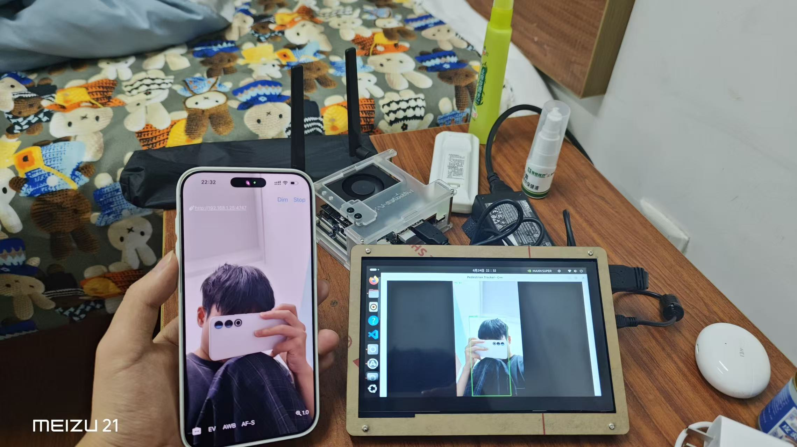

<p align="center">
  
  
  
  
  
  
</p>

<h1 align="center">🚶 Efficient Pedestrian Tracker</h1>

<p align="center"><b>Remote Connection Between Jetson Orin Nano and iPhone</b></p>
<p align="center"><b>基于 TensorRT + CUDA 的实时行人检测流水线</b><br>专为 NVIDIA Jetson Orin Nano 边缘计算平台设计<br>通过 HTTP 视频流实现 iPhone 摄像头与 Jetson 的远程连接</p>

<p align="center">
  
</p>
<p align="center"><i>实际运行截图：行人检测 + 实时 FPS 叠加显示（Jetson Orin Nano → iPhone 摄像头）</i></p>

---

## 🎬 Demo

https://github.com/user-attachments/assets/PLACEHOLDER

<!-- 
  如需嵌入演示视频，建议转换为 GIF：
  ffmpeg -i show/demo-video.mp4 -vf "fps=10,scale=800:-1" -loop 0 demo.gif
  然后上传到 GitHub Releases 或直接用相对路径引用
-->

## ✨ 特性

- 🚀 **四线程流水线架构** — 视频抓取、CUDA 预处理、TensorRT 推理、后处理显示并行执行
- 🎯 **YOLO11n INT8 量化模型** — 单类行人检测，极致推理速度
- ⚡ **零拷贝 GPU 预处理** — letterbox + BGR→RGB + 归一化 + CHW 转换在 CUDA kernel 中一次完成
- 🔄 **对象池复用** — 预分配 GPU/CPU 内存，运行时零分配
- 📊 **实时 FPS 统计** — 端到端帧率叠加显示
- 🎮 **即插即用** — 支持 HTTP 视频流（手机 IP 摄像头），命令行参数配置

---

## 🏗️ 系统架构

```
                        ┌───────────────────────────────────────────┐
                        │              FramePool (对象池)             │
                        │         预分配 4 个 Frame，循环复用           │
                        └──────┬──────────────────────┬─────────────┘
                               │ acquire()            │ release()
                               ▼                      ▲
┌──────────┐    q1     ┌──────────┐    q2    ┌──────────┐    q3    ┌──────────┐
│ Thread 1 │ ────────► │ Thread 2 │ ───────► │ Thread 3 │ ───────► │ Thread 4 │
│  视频抓取 │          │ CUDA预处理 │          │ TRT 推理  │          │ 后处理显示 │
│ Capture  │          │Preprocess │          │  Infer   │          │ Display  │
└──────────┘          └──────────┘          └──────────┘          └──────────┘
     │                     │                     │                     │
     │  HTTP 视频流         │  GPU: letterbox    │  GPU: enqueueV3     │  CPU: NMS + 画框
     │  cv::VideoCapture   │  + BGR→RGB         │  D2D memcpy         │  cv::imshow
     │  CPU 旋转 90°       │  + 归一化 + CHW     │  + 推理             │  + FPS 统计
     ▼                     ▼                     ▼                     ▼
┌──────────┐          ┌──────────┐          ┌──────────┐          ┌──────────┐
│ 手机摄像头 │          │  CUDA    │          │  TensorRT │          │  显示器    │
│ (IP Cam) │          │  Kernel  │          │  Engine  │          │  1024x600│
└──────────┘          └──────────┘          └──────────┘          └──────────┘
```

### 四线程流水线

| 线程 | 函数 | 输入 | 输出 | 主要工作 |
|---|---|---|---|---|
| **T1** 视频抓取 | `captureThread` | HTTP 视频流 | → q1 | 打开流，逐帧读取，CPU 旋转 90° |
| **T2** CUDA 预处理 | `preprocessThread` | q1 → | → q2 | H2D 上传，CUDA kernel 预处理 |
| **T3** TRT 推理 | `inferThread` | q2 → | → q3 | D2D 拷贝输入，`enqueueV3` 推理 |
| **T4** 后处理显示 | `displayThread` | q3 → | → 显示器 | 解析输出 → NMS → 画框 → 显示 |

---

## 📋 前置依赖

| 库 | 版本要求 | 用途 |
|---|---|---|
| **CUDA** | ≥ 11.4 | GPU 内存管理、CUDA Stream |
| **TensorRT** | ≥ 10.x | 模型加载与推理 (`libnvinfer`, `libnvinfer_plugin`) |
| **OpenCV** | ≥ 4.5 | 视频流读取、图像显示、NMS |
| **CMake** | ≥ 3.18 | 构建系统 |
| **GCC/G++** | ≥ 9 (支持 C++17) | 编译器 |
| **pthread** | 系统自带 | 多线程 |

> 推荐在 Jetson Orin Nano 上使用 JetPack 6.x，它预装了上述所有依赖。

### 模型准备

你需要一个 TensorRT `.engine` 模型文件。本项目的默认配置适用于 **YOLO11n 单类行人检测 INT8 模型**：

| 参数 | 值 |
|---|---|
| 模型 | YOLO11n (nano) |
| 类别数 | 1 (person) |
| 量化 | INT8 |
| 输入 | 3×640×640 float32 |
| 输出 | 1×5×8400 float32 |

导出命令参考 (Ultralytics)：
```bash
yolo export model=best.pt format=engine device=0 int8=True
```

---

## 🔧 构建

```bash
# 1. 克隆仓库
git clone https://github.com/YOUR_USERNAME/PedestrianTracker.git
cd PedestrianTracker

# 2. CMake 配置（Release 模式）
cmake -B build -DCMAKE_BUILD_TYPE=Release

# 3. 编译
cmake --build build -j$(nproc)
```

编译产物：
- `build/PedestrianTracker` — 主程序
- `build/Benchmark` — 性能基准测试

---

## 🚀 使用

### 基本启动

```bash
./build/PedestrianTracker
```

这会使用默认参数：
- 视频源：`http://192.168.50.127:4747/video`（手机 IP 摄像头）
- 模型：`/home/zhouco/human_test/yolo11n_human/best_int8.engine`

### 自定义参数

```bash
./build/PedestrianTracker \
  <视频URL> \
  <engine路径> \
  <置信度阈值>

# 示例
./build/PedestrianTracker \
  "http://192.168.1.100:4747/video" \
  "/home/user/models/best_int8.engine" \
  0.4
```

### 操作

| 操作 | 方法 |
|---|---|
| **退出** | 按 `q` 键 或 `Ctrl+C` |

### 手机摄像头设置

1. 在手机上安装 IP 摄像头 App（如 **IP Webcam** for Android）
2. 启动 App，记录显示的 HTTP 视频流 URL（通常是 `http://<手机IP>:4747/video`）
3. 确保 Jetson 和手机在同一局域网

---

## ⚡ 性能

> 测试平台：NVIDIA Jetson Orin Nano, YOLO11n, 640×640

### C++ 流水线（本项目）

| 阶段 | 预计耗时 | 说明 |
|---|---|---|
| 视频抓取 | ~5-10 ms | 受网络延迟影响 |
| GPU 预处理 | ~1-2 ms | CUDA kernel 并行 |
| TRT 推理 | ~8-15 ms | INT8 Tensor Core |
| 后处理+显示 | ~3-8 ms | CPU NMS |
| **端到端** | **~17 ms** | **实测约 60 Hz** 🚀 |

### Python 基准（单线程 PyTorch CUDA）

运行 `baseline_pytorch.py` 可作为性能下限参考：

| 阶段 | 预计耗时 | 说明 |
|---|---|---|
| 视频抓取 + CPU 预处理 | ~50-70 ms | ultralytics 内置 CPU resize/normalize |
| PyTorch 推理 | ~20-40 ms | FP16 CUDA（无 INT8，无 TensorRT 优化） |
| 后处理 + 显示 | ~5-10 ms | ultralytics 内置 plot |
| **端到端** | **~100 ms** | **实测约 10 Hz** 🐢 |

### 对比总结

| 维度 | C++ 流水线 | Python 基准 (`baseline_pytorch.py`) |
|---|---|---|
| **架构** | 4 线程并行 | 单线程串行 |
| **推理引擎** | TensorRT INT8 | PyTorch CUDA FP16 |
| **预处理** | GPU CUDA kernel | CPU (ultralytics) |
| **内存** | FramePool 预分配，零动态分配 | 每帧动态分配 |
| **实测帧率** | **~60 Hz** 🚀 | **~10 Hz** 🐢 |
| **加速比** | **6×** | 1× (基准) |
| **部署方式** | `./build/PedestrianTracker` | `python baseline_pytorch.py` |
| **依赖** | 仅需 TensorRT + OpenCV 运行时 | 需 ultralytics + PyTorch |

```bash
# 运行 Python 基准对比
python baseline_pytorch.py \
  "http://192.168.50.127:4747/video" \
  "best.pt" \
  0.5
```

### 性能优化技术

| 技术 | 位置 | 效果 |
|---|---|---|
| **四线程流水线** | 全局 | 计算与 I/O 重叠，最大化 GPU 利用率 |
| **CUDA GPU 预处理** | 线程 2 | 避免 GPU→CPU→GPU 往返，5 步合并为 1 个 kernel |
| **独立 CUDA Stream** | 线程 3 | 避免 TRT 使用 default stream 触发全局同步 |
| **INT8 量化** | 模型 | 体积减半，推理速度提升 40-60% |
| **FramePool 对象池** | 全局 | 启动时一次分配，运行时零 GPU 内存分配 |
| **有界队列 + 丢帧** | FrameQueue | 队列满时自动丢弃旧帧，保证实时性 |
| **非阻塞显示** | 线程 4 | `tryPop` 不等待，无帧时 sleep 1ms |

---

## 📁 项目结构

```
PedestrianTracker/
├── CMakeLists.txt                  # CMake 构建配置
├── README.md                       # 本文件
├── LICENSE                         # MIT 许可证
├── baseline_pytorch.py             # Python 单线程基准（性能对比用）
├── show/
│   └── demo-screenshot.jpg         # 运行截图
├── src/
│   ├── main.cpp                    # 程序入口
│   ├── trt_engine.cpp              # TensorRT 引擎封装
│   ├── worker_threads.cpp          # 工作线程 + YOLO 后处理
│   └── cuda_preprocess.cu          # CUDA 预处理 kernel
├── include/
│   ├── trt_engine.hpp              # TRT 引擎头文件
│   ├── worker_threads.hpp          # 工作线程头文件 + Frame/Detection 结构体
│   ├── frame_queue.hpp             # 线程安全队列模板
│   └── cuda_preprocess.h           # CUDA 预处理接口 + PreprocessBuffers 结构体
└── .vscode/
    ├── settings.json               # VS Code CMake 配置
    ├── launch.json                 # GDB 调试启动配置
    └── tasks.json                  # 构建任务 (make)
```

总代码量约 1150 行，结构清晰，模块分明。

---

## 🧩 核心模块

### `FrameQueue<T>` — 有界线程安全队列

- 模板化设计，可存放任意类型
- 容量满时自动丢弃最旧帧（非阻塞 push，保证实时性）
- 双条件变量：消费者等待 + 生产者等待
- `stop()` 优雅关闭，`droppedCount()` 丢帧统计

### `TensorRTEngine` — TRT 10.x 推理引擎

- RAII 资源管理，支持移动语义
- 遍历 I/O tensor 动态绑定 buffer (`setTensorAddress`)
- 独立 CUDA stream 避免全局同步
- 完整日志：模型大小、tensor 名称/维度/大小

### `cuda_preprocess` — GPU 预处理

- 双线性插值采样（BGR HWC → RGB CHW）
- letterbox 缩放 + 灰边填充 (114, 114, 114)
- 归一化到 [0, 1]
- `16×16` 线程块，`40×40` 网格（640×640 目标）

### `worker_threads` — 流水线工作线程

- **FramePool**：预分配 N 个 Frame，循环使用
- **parseYoloOutput**：CHW 布局解析，中心点→角点转换，OpenCV NMS
- **FPS 统计**：推理 FPS 每 2 秒打印，端到端 FPS 每秒更新到画面

---

## 🎯 设计决策

| 决策 | 原因 |
|---|---|
| **GPU 预处理** | 避免 D2H→H2D 往返；kernel 并行度 409,600 像素 |
| **INT8 量化** | Jetson Orin Ampere GPU 有 INT8 Tensor Core 专门加速 |
| **置信度阈值 0.45** | INT8 量化后置信度自然偏低，降低阈值防止漏检 |
| **90° 旋转** | 手机摄像头默认横屏输出，旋转后得到竖屏画面 |
| **FramePool = 4** | 流水线最多同时 4 帧在途（抓取、预处理、推理、显示各 1） |
| **QueueSize = 2** | 小容量背压控制，防止内存堆积 |

---

## 🔍 数据流

```
原始帧 (CPU) → [Thread1: 抓取+旋转] → q1
  → [Thread2: H2D → GPU letterbox → CHW float32] → q2
    → [Thread3: D2D copy → enqueueV3 → D2D copy] → q3
      → [Thread4: D2H → parse + NMS → 画框 → imshow] → 归还到 FramePool
```

每个环节 GPU/CPU 内存均在 FramePool 中预分配，运行时零动态分配。

---

## 📄 License

MIT License

Copyright (c) 2025

---

## 🤝 贡献

欢迎提交 Issue 和 Pull Request。

---

> 💡 **提示**：本项目专为 Jetson Orin Nano 设计，但理论上可在任何支持 CUDA + TensorRT 的 NVIDIA GPU 上运行（需调整 CMakeLists.txt 中的 `CMAKE_CUDA_ARCHITECTURES`）。
